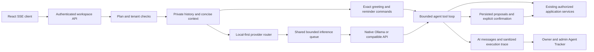

# Local AI and Agent Tracker

This release makes the configured Ollama/OpenAI-compatible model primary, with no required Claude key. It adds bounded inference, smaller requests, authorized document retrieval and a workspace Agent Tracker. It does not train model weights or establish production model quality or latency.

## Deployment evidence and storage warning

The supplied Railway screenshot shows API, frontend, PostgreSQL, Redis and Ollama as separate services in one project. The reported warning is `ollama-volume` at 96%: 4.79 GB used on approximately 5 GB, leaving approximately 210 MB. This is insufficient headroom for another multi-GB model. Storage pressure can prevent downloads or updates; it is not measured evidence that storage caused slow inference.

The account screenshot confirms the Hobby plan ceiling is up to 8 GB RAM, 8 vCPU and 100 GB shared disk. These plan maxima do not establish this service's configured quotas or the size of its persistent volume. The installed tag is `qwen2.5:7b-instruct-q4_K_M` (4.7 GB), confirmed by the supplied model inventory. Actual CPU quota, memory cap and persistence mount still need verification. The Railway project is named `ProjectManagment`; it shows approximately $2.19 current project usage. The Sep 26–Oct 26 account cycle shows $7.69 current usage, $5 included usage and a $13.78 estimated account bill, covering other projects too. Neither the account estimate nor usage-chart maxima are an Ollama-specific forecast.

Before making storage changes, run these **read-only** commands inside the Ollama service:

```sh
ollama list
ollama ps
df -h
cat /sys/fs/cgroup/cpu.max
cat /sys/fs/cgroup/memory.max
```

Confirm the configured `OLLAMA_MODELS` directory is mounted on `ollama-volume`. Inventory installed tags and blob storage, including incomplete downloads. Do not delete model blobs by hand: models can share them. Do not remove the active/configured tag or increase the volume automatically. Once unused tags are identified, an administrator can deliberately remove those tags with `ollama rm TAG` and recheck disk space. Changing models needs enough staging space or a planned maintenance window; do not pull a second large model into a 96%-full volume.

## Request architecture and confirmed code defects



Before this change, both routers preferred Claude whenever a key existed. Chat history and routing metadata recorded Claude tier models even when a local model answered. Native streaming omitted `num_predict`; one-shot calls ignored native wire configuration. Every question included the full catalog and expensive workspace facts, and default classification could add a model call before the answer. Stream EOF could be accepted without a completed turn. Simultaneous confirmations used a non-atomic read/save sequence.

The default is now local-first, even if a legacy Claude key remains. Anthropic is optional compatibility support and requires **both** `Ai__PrimaryProvider=anthropic` and `Ai__AllowAnthropic=true`. No local failure silently invokes Anthropic. Explicitly configured third-party compatible endpoints remain possible; verify the endpoint is your local service when avoiding external API charges.

## Railway API settings

Keep the existing `Ai__Fallback__*` names to avoid breaking deployed settings; these now configure the primary local provider. Example API variables:

```text
Ai__PrimaryProvider=local
Ai__AllowAnthropic=false
Ai__Fallback__BaseUrl=http://ollama.railway.internal:11434
Ai__Fallback__Wire=ollama
Ai__Fallback__Model=<exact installed Ollama tag>
Ai__Fallback__Name=Ollama
Ai__Fallback__ThinkingTokens=0
Ai__Fallback__MaxOutputTokens=1024
Ai__Fallback__MaxConcurrentRequests=1
Ai__Fallback__MaxQueuedRequests=4
Ai__Fallback__QueueTimeoutSeconds=10
Ai__Fallback__TimeoutSeconds=120
Ai__Fallback__MaxPromptChars=48000
Ai__Fallback__KeepAlive=10m
Ai__Chat__UseClassifier=false
Ai__Chat__ExecutionTimeoutSeconds=180
Ai__TraceRetentionDays=30
```

Remove `Ai__AnthropicApiKey` from API settings when it is no longer needed. Defaults do not use it. Do not expose Ollama publicly without authentication; the API should use Railway private networking. Do not put API keys in the frontend.

Set `Ai__Fallback__NumThread` to the **actual Ollama CPU quota**, not host logical CPUs or usage-chart maxima. Set `Ai__Fallback__NumCtx` after measuring RAM and representative prompt token counts: 8192 is a candidate, not a verified fit for this service. The character guard is not a tokenizer; a model/runtime can still truncate inside its configured token window. Overflow detected by the application is rejected explicitly. Images require explicit `SupportsImages=true` and a tested vision model; PDFs are rejected rather than silently omitted. Extract text for the current CPU text model.

On the Ollama service, consider `OLLAMA_NUM_PARALLEL=1` and `OLLAMA_MAX_LOADED_MODELS=1` after checking the installed runtime version. These are service settings, not API settings. Application queues are per API process; multiple replicas need a coordinated limit or a provider-level limit. No model download, warm-up or resource allocation is performed by this release. Keep-alive trades memory residency against cold-start cost and should be benchmarked.

Quick/Standard/Deep plan credits are preserved. With local inference, all levels use the same configured tag and output cap; they do not imply three different models. Override the output cap when evaluations show longer structured outputs are required. Existing Anthropic pricing estimates apply only to recorded Claude model names. Local tokens do not incur an external per-token API fee; Railway hosting still costs money.

## Persistence, access and rollback

`20261009164837_AiAgentTracker` adds nullable `AiMessages.ExecutionJson`. It reuses tenant-scoped messages, their tenant/date index and existing feedback rather than creating duplicate execution tables. PostgreSQL uses the existing migration workflow (`Database:AutoMigrate`, enabled by default); back up and review migrations before production rollout. Existing development SQLite databases receive the additive column without erasing their data.

Trace fields contain correlation, configured provider/model, durations, tool names, result states, usage and sanitized error codes. They do not contain user requests, tool arguments, result content or documents. Owners/Admins can view workspace traces; ordinary members cannot. Conversations remain owner-private. Disabling the shared Project Assistant uses the existing audited workspace switch.

The tracker is one shared agent registry entry, not a list of fictional specialist agents. It shows completed runs; it is not a durable queue of active jobs. The date window is limited to 31 days and metrics explicitly flag sampling above 10,000 records. Traces are cleared in batches after the configured retention period, independently of credit accounting and conversation contents. New trace fields are part of the existing answer save; there is no additional telemetry insert on a business transaction. Cleanup and corrupt optional-trace failures are isolated.

An outcome of `succeeded` means the bounded run completed without a reported tool/provider failure; it is **not** a model-quality certification. Proposed writes remain `awaiting_confirmation`; a failed confirmed action becomes partial. Cancellation/limits and tool errors must not be interpreted as verified task completion. Confirmation claims use database compare-and-swap, and one action per answer runs at a time. A process crash or interrupted multi-operation action can leave uncertain/partial side effects: do not automatically retry these without checking the application. Durable recovery and exactly-once external side effects are not implemented.

Rollback the application to its previous version while leaving the additive column in place. Rolling back to legacy defaults can re-enable Claude when a key exists; remove the key if avoiding paid usage. Drop the column only deliberately after exporting operational traces; dropping it is not needed for application rollback.

## Validation and measurements

A reproducible scripted-provider test measures these payloads:

| Request component | Previous path | Local path |
| --- | ---: | ---: |
| Fixed system instructions | 6,692 characters | Concise application rules; see LocalSystemPrompt |
| Greeting model calls | At least 1 | 0, application response |
| Focused reminder tools | Full catalog | Up to 6 |
| Common task lookup tools | 26 | 4 |
| Default preliminary classifier calls | Potentially 1 | 0 |
| Native output cap | Missing | 1,024 tokens by default |

The previous tool count includes this release's two retrieval tools for an equal-capability comparison. The original catalog had 24 tools. These are measured payload reductions, **not** measured Railway latency improvements. Complex/unrecognized intents retain the full catalog; non-English requests are not stripped of capabilities based on English keywords.

Run the synthetic read-only provider benchmark **from an environment that can reach the private Ollama service**, using exact installed model tags:

```sh
export OLLAMA_BASE_URL=http://ollama.railway.internal:11434
python tools/ai-evaluation/benchmark.py --model '<installed tag>' --threads 2 --repeats 10 --output /tmp/ai-baseline.json
```

Replace `2` with the actual quota. Repeat on the same service with the same dataset and settings. Compare installed smaller models by repeating `--model`; this script does not download anything or execute application writes. It reports cold-load, prompt evaluation, generation, first visible-text latency, tokens/second, overall latency and expected tool/argument checks. The small versioned dataset covers greetings and two tool-selection cases; it does not replace application permission, side-effect, multilingual or long-document evaluations. Run those through the actual application and inspect Agent Tracker alongside Railway CPU/RAM and API latency. Collect enough samples before claiming p95 targets.

Validation on this branch: 844 backend tests and 68 frontend tests passed; TypeScript checking, Vite production build and lint passed (75 existing lint warnings, zero errors). PostgreSQL migration SQL was generated and inspected; no live PostgreSQL migration or Railway inference benchmark was run.

Backend scripted tests cover provider selection with Claude absent or accidentally configured, native one-shot/streaming behavior, errors/EOF, cancellation/deadlines, bounded queues, overflow, tenant/admin privacy, paging, document visibility/chunks, loop stopping and reduced requests. A Chromium smoke test uses a **scripted local provider**, with no Claude credentials, to verify streaming, persisted tracker data, trace expansion, health, switches, filters and empty state. It does not measure LLM intelligence.

## Reminder and attachment reliability follow-up

The supplied October 9 Railway logs establish two separate performance costs:

- A direct cold greeting took 62.58 seconds, including 60.77 seconds loading weights. The immediately repeated cached greeting took 0.37 seconds. This is not a general project-query benchmark.
- Application prompts reached 5,168 tokens with 57.7 seconds of prompt evaluation. A later request reprocessed 3,677 tokens in 45.9 seconds and generated 52 tokens in 6.1 seconds. The application runner used 10 inference threads and an 8,192-token context; the diagnostic runner used 2 threads and 2,048 tokens. Switching those settings caused another load.
- API logs explicitly show two HTTP 400 errors: `Multimodal data provided, but model does not support multimodal requests.` The second text question still carried a historical image. This was not a timeout or an out-of-memory diagnosis.

The follow-up implements an application path for exact greetings and a small set of exact reminder commands. It does not call Ollama, spends zero inference credits, and records `application` / `builtin-greeting` or `builtin-reminder` in the tracker with no fictional model token usage. Plan, user, workspace and confirmation checks still apply. Examples:

- `Hi`, `how are you?`, `thanks` return concise application responses.
- `create reminder for 23:35 as test 3` proposes today only when that local time is still future; otherwise it asks for a date.
- `change it to 23:36` revises the one pending reminder in this conversation, preserving its date. Ambiguous references fall back to the model.

These are narrow command recognizers, not a general natural-language interpreter. Focused model-driven reminder requests use up to six tools and stop after producing their validated card, avoiding another inference just to narrate it. Compound requests keep the full catalog and model loop for dependent steps. Local requests no longer compute or send the entire workspace overview automatically; relevant facts come from permission-checked tools. History is bounded to twelve messages, with an explicit notice when older turns are omitted. Current local date, time and zone are supplied.

`list_reminders` reads saved reminders through ReminderService. `propose_update_reminder` reschedules an authorized saved reminder after confirmation and preserves notes and recurrence. `revise_reminder_proposal` creates a replacement card for a pending reminder in the same private conversation. Replacements share the original proposal's atomic claim: an original and a replacement, or two replacements, cannot both create a reminder. If one was already handled, the other fails explicitly. After confirmation the UI refreshes older card states.

Replacement claiming happens before creating the new reminder. A validation failure or process crash after that claim leaves the original dismissed and the replacement failed/uncertain; check Reminders and make a new proposal deliberately. This is at-most-once protection, not durable exactly-once recovery. Other replacement cards may still show proposed until their confirmation checks the shared claim.

Unsupported images and PDFs are rejected before upload or question submission with `AI_ATTACHMENT_UNSUPPORTED`. The file picker receives the actual supported extensions. Historical unsupported attachments become a notice rather than binary input, so later text questions work; the assistant is told not to infer the contents. Text, CSV, Markdown, Word and spreadsheet extraction remain supported. Enabling vision needs a tested vision model; this change does not add OCR or image understanding.

Validation after the follow-up: 852 backend tests passed (zero failures/skips); 68 frontend tests, type checking, production build and lint passed (75 existing warnings, zero errors). A twenty-request warm in-process API greeting test measured mean 4.1 ms and p95 7.1 ms with zero model calls. This excludes HTTP transport, Railway scheduling and production database latency; it is not a production benchmark.

No Railway resources, model tags or volume contents are changed by these code fixes. Keep `NumCtx`, `NumThread` and the installed model consistent between diagnostics and the application. `KeepAlive=10m` helps nearby requests but keeps memory resident; do not assume that cost is free. Complex CPU inference and post-idle cold starts still require measured hardware/model tradeoffs. No sub-second production latency is promised.

## Costs and next acceptance gates

Using the prices supplied from this Railway account, illustrative 30-day constant usage costs are approximately $39.92 for 4 GB resident memory, $20.00 for 1 vCPU continuously used, and $0.75 for a 5 GB volume, before other services, credits, plan fees or taxes. These are arithmetic examples, not a forecast of this deployment: actual usage duration and allocations were not provided. The warning is storage capacity, not proof that the current accumulated $2.18 will stay small at continuous inference usage.

| Hosting option | Evidence and decision |
| --- | --- |
| LLM in the API container | Not the supplied screenshot's topology. Would contend directly with the API; no measured benefit justifies consolidation. |
| Separate Ollama service in the existing Railway project | Current topology. Preserve it; inventory disk, verify quotas and measure latency before resizing or changing models. Actual cost depends on measured usage at the account's rates. |
| Separate CPU server | No server quote or benchmark available. Introduces deployment work and additional hosting cost; do not migrate automatically. |

Remaining master-objective gates are real-model tool/quality benchmarks, actual resource/latency comparison, Railway storage remediation after inventory, durable cross-request workflow recovery, a complete evaluation dataset, versioned repository-knowledge indexing, organization-wide verified outcome memory and prediction calibration. Existing private preference learning, permission-aware document indexing, deterministic workload/history analysis and pace-based forecasts are reused; they are not newly trained capabilities. Fine-tuning requires a measured gap and controlled datasets, evaluation and rollback. No automatic production training is introduced.
