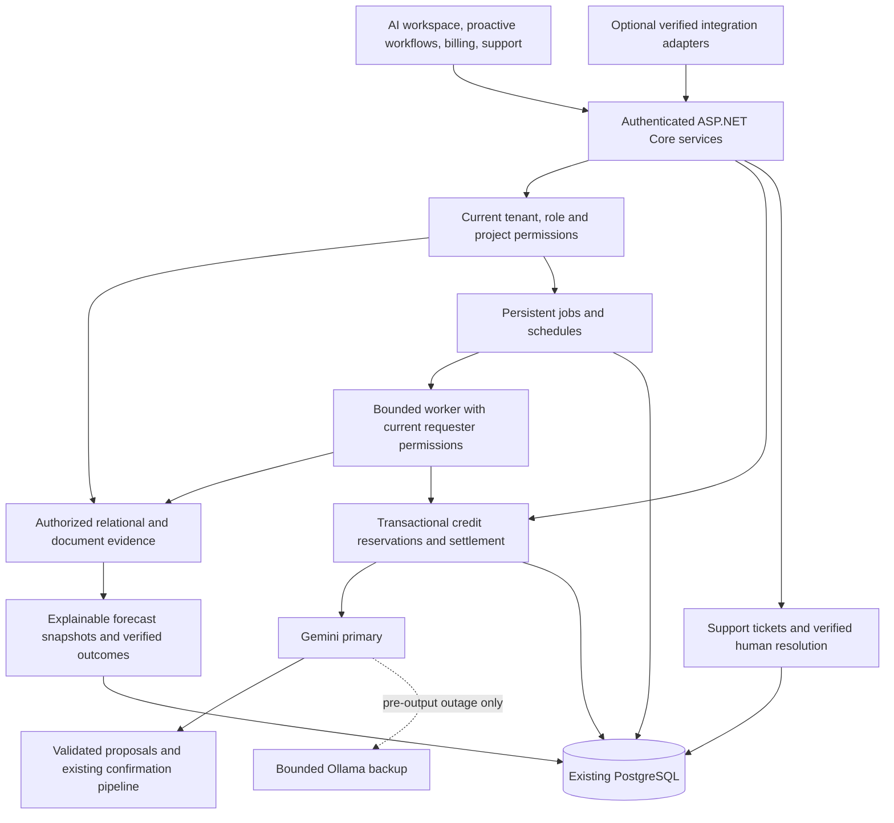

# Enterprise agent implementation audit

Baseline: `8b343da2f96c67d2f8d50e862b56b9eb56a2e64c`, October 10, 2026. The three supplied enterprise briefs guide this work. The latest instruction prohibits bulk AI tests; use scripted models, targeted regression tests and existing CI instead. Earlier simple provider bursts are historical evidence, not enterprise workload capacity.

## Existing implementation and gaps

| Area | Repository evidence | Required change |
|---|---|---|
| Web/API/authentication | `frontend/src/App.tsx`, `Api/Middleware/Middleware.cs`, `Application/Services/PermissionService.cs` | Preserve current routes, role profiles, tenant filters and project/document access. Resolve current permissions again for background work. |
| Model routing | `Infrastructure/Services/GeminiChat.cs`, `AiBackupChat.cs`, `AiBackupClient.cs` | Gemini is already primary in production. Keep bounded local fallback and quota controls. No new bulk provider benchmarks. |
| Reliable actions | `Application/Features/Ai/AiActionPlan.cs`, `AiAgent.cs`, `AiActionRunner.cs`, `AiPersonMatching.cs` | Existing hash-bound approvals, expiry, dependencies, transactional execution and recipient/date regression tests remain authoritative. Scheduled agents must not circumvent them. |
| Intelligence | `Application/Features/Ai/AiPortfolio.cs`, `AiAnalysis.cs` | Existing deterministic portfolio pace forecasts, historical workload and scenario analysis. Persist methodology, evidence, timestamp and forecasts for later outcome evaluation. Confidence labels are heuristics, not calibrated probabilities. |
| Retrieval | `Application/Features/Documents/DocumentSearch.cs`, `AiToolbox.cs` | Already has authorized document search and versioned read citations. Reuse relational/document access; add a unified evidence interface, avoid a separate vector service until evaluated. |
| Durable processing | `Application/Features/Reports/ReportExportService.cs`, `Features/Automation/AutomationService.cs`, existing workers | Add persistent agent jobs, recurrence, atomic claims, cancellation, restart recovery, bounded retry and private results. No in-memory-only scheduling. |
| Credits | `Application/Features/Ai/AiAgent.cs`, `AiUsageService.cs` | Monthly credit checks currently sum saved answers before dispatch; concurrent requests can overspend. Add transactional reservations and immutable settlement history without changing plan prices. Gemini usage currently costs zero in the admin estimate because only Claude is priced; fix using explicitly versioned configuration. |
| Payments | `Features/Billing/BillingWebhookService.cs`, `BillingService.cs`, `Infrastructure/Services/RazorpayPaymentProvider.cs` | Existing verified subscription payments and webhook deduplication. AI top-ups must be a distinct verified purchase type; never mint credits from a browser success callback. Commercial pack rates remain unpublished until configured. |
| Support/integrations | Work tasks, SLA workers, inbound email, outbound webhooks and Google integrations already exist | Add ticket resolution confirmation and human escalation. Slack/WhatsApp require separately configured installations, identity mappings and signed/deduplicated inbound events; do not claim live integrations without accounts and end-to-end verification. |
| Observability | `AgentTrackerService`, `AiExecutionTrace.cs`, worker heartbeats | Preserve sanitized traces and private conversations. Add job states and accounting outcomes without prompt content in administrative usage reports. |

## Architecture

## Delivery sequence

1. Persistent proactive workflows and restart-safe, permission-aware jobs; expose job history, cancellation, schedules and evidence in the existing AI UI.
2. Transactional monthly credits and immutable reservations/settlements, scoped budgets and provider cost reporting; preserve current entitlements.
3. Unified authorized knowledge evidence, document workflows and forecast outcome evaluation.
4. Ticket lifecycle, verified resolutions, human escalation and approved support knowledge.
5. Optional signed integration adapters and verified purchase/top-up configuration; finish admin/pricing surfaces without invented rates.
6. Focused permission, restart, idempotency, credit concurrency, date/recipient and outcome regressions; builds and existing CI; merge verified phases into main.

This is autonomy through explicit organization policy, persistent work and evidence. Provider quotas, tenant permissions, approvals and budgets remain enforced. Predictions do not automatically change staffing, dates or permissions. External messaging remains disabled until its configuration and delivery semantics are verified.

## Implementation progress

- Durable private portfolio, workload and history reviews, recurring schedules, atomic leases, cancellation, retry and restart recovery are implemented. Requester permissions are rebuilt before execution; changed access hides saved evidence. The existing UI exposes schedules, progress and sources.
- Transactional customer credit reservations, append-only settlements, legacy opening balances, abandoned-hold recovery and opt-in user/team budgets are implemented. One-shot features use the same ledger. Built-in greetings and confirmations remain available after the paid credit balance is exhausted.
- Provider cost snapshots distinguish customer credit charges from recorded token cost. Gemini estimates are priced; unknown/incomplete usage is explicitly reported. See [credit accounting](AI-CREDIT-ACCOUNTING.md) for policies and exclusions.
- Authorized retrieval consolidation, outcome evaluation, support lifecycle, verified top-up configuration and optional integration contracts remain subsequent phases. Production deployment and merge verification remain pending for this branch.
