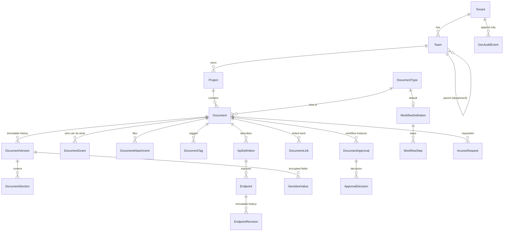
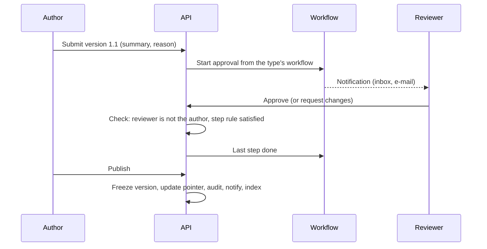
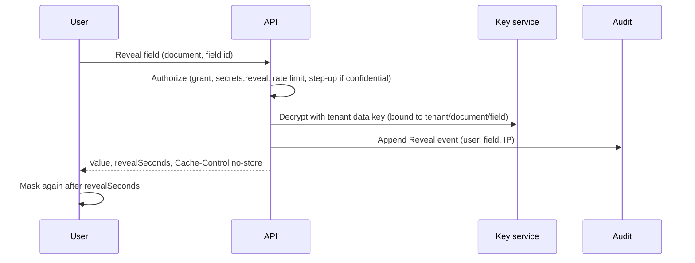

# Proposal (draft for review, nothing built): Documentation and BRD platform inside Project Tracker

**Status:** revision 2, after review. **Releases D1 to D5 are built, and D6 in part** (PDF export, full-text search, overview; the visual diagram editor is still to do; text diagrams and SSO group mapping are built) (see section 11). D2 differs from the plan in one place: sharing uses three fixed levels (reader, editor, manager) instead of a configurable `DocRole` table; configurable roles are still open. D3 differs from the plan in four places: workflow steps are stored as JSON on the definition (no `WorkflowStep` table); requirements are a numbered register per document with links to work (not a table section of the text), so they are not versioned with it; a *test* is a task or work item linked as "verifies", and a failing test is a verifying test issue that is not fixed yet; and the audit trail uses the existing audit log (`audit.view`, `AUDIT_LOG`) rather than a new table, so the hash chain and partitions of section 10 are still to do. D4 differs in these ways: an API's endpoints are one row each with their details as JSON (no separate `ApiDefinition` revisions: the definitions are kept once per published version in `ApiSnapshot`), a published version keeps a full copy of the endpoints (`EndpointRevision`) instead of only the changed ones, the document's draft hash includes a fingerprint of the API (so a changed API counts as an unpublished change), the endpoint count is limited per workspace (`DOC_ENDPOINT_LIMIT`), search covers *published* endpoints only (drafts are read in their document), and OpenAPI import takes JSON and YAML (YamlDotNet) but export is JSON. D5 differs in these ways: a secret is a field of the document kept beside its text (a *Secrets* panel with a reference by name, not an inline node), step-up is a two-step code or recovery code valid 5 minutes (passkey step-up is still to do), the hash chain is per workspace over the existing audit log (`Seq`, `PrevHash`, `Hash`) with the last purged row kept as the anchor, the PostgreSQL immutability is a trigger that refuses UPDATE and DELETE (retention sets a transaction-local flag) rather than a separate database role, and **row-level security is not built** (tenant isolation stays in the application's query filters, as in every other module). D6 (part) differs in these ways: the PDF is laid out by the product's own renderer behind `IDocumentPdfRenderer` instead of QuestPDF (no native library, no licence; the standard PDF fonts, so Western European text only; a renderer with embedded fonts can replace it), it runs in the existing report queue (`ReportKind.Document`), two at a time per instance, and refuses more than 600 pages; search is one indexed condition over each document's `SearchText` (title, tags and what readers see, never secret values) with a PostgreSQL trigram index, not `tsvector`; the overview counts come from the same filtered query as the list. SSO group mapping is a table of provider group to team applied at sign-in (teams added by sign-in are marked and removed again; manual memberships are never touched). The PDF and the API reference page share one design (logo, cover, lifecycle ring, endpoint pages with masked requests); the logo is decoded by our own PNG/JPEG reader. Diagrams are the flowchart subset of Mermaid, drawn by our own layout on the server (one layout for the SVG and the PDF drawing) instead of mermaid.js, which needs a browser to render and so could not match the PDF. Not built yet: the visual diagram editor, other Mermaid diagram kinds, the 20-document concurrent-export load test. The decisions taken in review are in section 0; the few questions still open are in section 15. We then build release by release (section 11), each release shipped, tested and merged on its own.

**Reference studied:** `projecttrackerindia/doctracker` (Node/Express, PostgreSQL, plain JavaScript front end). We port its ideas into our stack (ASP.NET Core 9, EF Core, React 19). We do not port its code.

---

## 0. Decisions taken in review (these override anything below that disagrees)

| # | Decision | Effect on the design |
|---|---|---|
| 1 | **No multiple environments and no release promotion.** | `DocEnvironment`, environment-scoped access and the promotion/diff pipeline are removed. An API definition has one set of documented endpoints plus a free-text list of server URLs (display only). Versions (1.0, 1.1, 2.0) are the only axis of change. |
| 2 | **Build it inside Project Tracker, linked to projects and tasks, everything in one place.** | Documents live under a project (or a team, for general documents) and **link both ways** to projects, tasks, issues, work items and sprints. A task shows its documents; a document shows its linked work with live status. See section 5.2. |
| 3 | **Available on every plan, with pricing-based limits.** | Free gets a real but small allowance; governance features follow the plan tiers we already sell. See section 12 (Plans and pricing). |
| 4 | **PDF with QuestPDF (the free Community license you hold).** | No Chromium container. A .NET renderer inside the API/worker, with a documented license condition. See section 9. |
| 5 | **Retention follows the plan.** | Version history and document audit events are kept for the plan's retention period (the same number the product already uses for activity), and a workspace may only shorten it. See section 12.3. |

## 1. The idea in one paragraph

Teams already plan work in Project Tracker. What they write about that work (BRDs, API documentation, test plans, architecture notes, release notes) lives somewhere else, with no link to the project or the tasks, no real access control, no history and no proof of who saw a secret. The proposal is a **Documents module** inside the product: every document belongs to a project or team, is **linked to the tasks and issues that implement and test it**, is typed (BRD, API documentation, ...), is versioned without overwriting, moves through a configurable approval workflow, is shared with exact people, teams and roles, hides secrets until a permitted person reveals them for a few seconds, and exports to PDF. It reuses what we already have (tenants, teams, roles, projects, audit, notifications, file storage, jobs, billing plans) instead of building a second product.

## 2. What the analysis found

### 2.1 Our application (what we can reuse)

| Need in the brief | What exists today | Verdict |
|---|---|---|
| Multi-tenant, data of one organization never visible to another | `Tenant`, `TenantEntity`, `ITenantScoped`, EF global query filters, an isolation guard test, tenant-aware tests on SQLite and PostgreSQL | **Already built.** New tables only have to follow the same pattern. This is the biggest saving. |
| Organization, teams, members, team leads | `Tenant`, `Team`, `TeamMember(IsLead)`, `TenantMember(Role, OrgRoleId)`, org chart `OrgRole` | Reuse. Add an optional parent on `Team` for "Department". |
| Roles and permissions | `TenantRole` (Owner, Admin, Manager, Member, Guest), permission catalog (`Permissions`), per-tenant overrides, job-role `AccessProfile`, `ProjectScope` filters in the data layer | Reuse and extend with document permissions. Do not change the `TenantRole` enum. |
| Project to team link | `Project.TeamId`, team lens, `ProjectAccess` | Documents hang off `Project`. |
| Authentication | Passwords, MFA, passkeys, phone approval, SSO (OIDC and SAML), SCIM, sessions, API keys | Reuse. Step-up for secrets reuses MFA and passkeys. |
| Audit | `AuditLog` (user, action, entity, old/new value, IP, user agent), `Recorder` | Extend (new actions, tamper evidence, retention). |
| Notifications | `Notification` with in-app, e-mail, push, browser, dedupe, workers | Reuse. Add document event types. |
| Files | `Attachment`, `IFileStorage` (local and S3), content checks, SHA-256 | Reuse for document attachments and diagrams. |
| Background jobs | `ReportExport` entity and `ReportExportWorker`, workers for e-mail, push, webhooks | Reuse the export queue for PDF. |
| Encryption at rest | `ISecretProtector` (AES-256-GCM, random nonce, authenticated) | Reuse, then add key versioning (section 8). |
| Search | `pg_trgm` indexes migration, global search (Ctrl K) | Extend to documents, endpoints, tags. |
| Billing and limits | Plan catalog, `EntitlementService` (per-person limits, pooled storage) | Add a `DOCS` feature and limits. |
| API quality | Idempotency keys, If-Match, rate limiting, public OpenAPI, Swashbuckle | Reuse. |
| Diagrams | `@xyflow/react` is already in the front end (org chart canvas) | Reuse for the visual diagram editor (release 5). |
| PDF | `PdfWriter` inside `ReportDocument` (a small hand-written writer for tabular reports and invoices) | **Not enough** for rich documents; replaced by QuestPDF for documents (section 9). |
| Retention | `DataPolicyService` (per-workspace activity, notification, chat and audit retention, nightly purge with minimums) and the plan value `ACTIVITY_RETENTION_DAYS` (Free 30, Pro 365, Business 730, Enterprise unlimited) | Reuse. Documents plug into the same policy and purge job (section 12.3). |
| Work to link to | `Project`, `TaskItem`, `Issue`, work items, `Sprint`, short keys such as WT-12, global search, assistant tools | Reuse. Documents get their own key (`DOC-12`) and typed links to each of these (section 5.2). |

### 2.2 The reference (DocTracker): what to learn from it

Strengths worth porting (as ideas):

- **Environment-scoped, time-boxed access requests** with a full history and "a requester can never approve their own request".
- **Envelope encryption with admin-triggered key rotation**, and secrets never returned to the browser (AI key shown only as "configured").
- **Server-recorded audit log**; the client cannot write it.
- **PII masking rules**, enforced on the server and mirrored in the UI.
- **Breaking-change detector** that flags only changes a client would really break on. We keep this, applied between two *versions* of an API document (not between environments).
- **Export**: OpenAPI, Postman collection import/export, PDF.

Deliberately **not** ported (decision 1): multiple environments, environment-scoped access, release promotion between environments, the runtime log agent and alert engine, and "Try it" live calls.

Weaknesses we must not copy:

| DocTracker choice | Why it will not scale for us | Our approach |
|---|---|---|
| A whole project (endpoints, attachments, everything) is one encrypted JSON blob in `projects.data` | Cannot query, search, index or paginate; every change rewrites the blob; thousands of endpoints per project is impossible; no row-level security | Normalized tables: `ApiDefinition`, `Endpoint`, `EndpointRevision`, with indexes |
| Authorization is partly in a front-end state object and in a 3,600-line `workspace.js` | Hard to reason about, hard to test | One `DocumentAccess` service, one permission model, data-layer filters |
| Plain JavaScript, 26 order-dependent script files, no bundler | No types, no component reuse | Our typed React app |
| No route-level or database tests | Regressions slip in | Dual-engine integration tests per release (our existing standard) |
| In-memory per-process throttles | Wrong behavior with several instances | Our existing shared rate limiting |
| No SAML, no SCIM | Enterprise blocker | We already have both |
| Observability agent, log explorer, alert engine for MuleSoft traffic | A different product (runtime monitoring) | **Out of scope** |
| Multiple environments and release promotion | Adds a second dimension to every document, permission and screen | **Dropped** (decision 1) |
| "Try It / Live mode" outbound calls | A large attack surface (SSRF), not in this brief | Not built |

### 2.3 Technical debt and risks in our own code that this work touches

1. `AuditLog` can be updated or deleted by the application's own database user. It must become append-only with tamper evidence before we call it "immutable to normal users".
2. `ISecretProtector` uses one derived key with no key identifier, so rotation is impossible. Needed before storing client secrets.
3. Search is `ILIKE` with trigram indexes. Fine to about 100k rows per tenant; beyond that we need PostgreSQL full text (and an optional external index later). SQLite (used for local development and tests) has no `tsvector`, so every search path needs a portable fallback and tests on both engines.
4. `ProjectAccess` and `ProjectScope` decide visibility of projects. Documents need a **second, finer** layer (a document can be more restricted than its project). That layer must live in the data layer, not only in services.

## 3. Product shape

```
Organization (Tenant)
 ├─ Department (a Team that has child Teams; optional)
 │   └─ Team
 │       └─ Project            (existing)
 │           └─ Document       (new: typed, versioned, workflow-driven)
 │               ├─ Sections, attachments, diagrams, sensitive fields
 │               └─ for API documentation:
 │                    ApiDefinition ─ Endpoint ─ EndpointRevision
 └─ Document types, workflows, roles (all per-organization configuration, seeded with defaults)
```

A document belongs to one project, or (for general documents such as policies and process descriptions) to a team, and always to its organization. A BRD that several teams need is **allocated** (shared) to them; it is not copied. Separately, a document can be **linked** to any number of projects, tasks, issues, work items and sprints (section 5.2), so the document, the work that delivers it and the tests that verify it sit one click apart.

## 4. Document types are data, not code

`DocumentType` is a row: name, icon, **section template** (ordered list of section definitions with a field kind: rich text, table, list, key-value, api-list, diagram, risk register, ...), default workflow, whether it supports API definitions, and default sensitivity. Seeded types: BRD, API documentation, technical, functional, test plan, test cases, test results, integration, architecture, deployment, operational, project, process, security, release, environment. An administrator can add a type or edit a template without a deployment.

A document stores its content as **sections** (`DocumentSection`: key, title, kind, order, content JSON). Structured fields and rich text live side by side: a BRD "Risks" section is a table with columns (risk, impact, mitigation, owner); "Business requirements" is rich text. Rich text is stored as ProseMirror JSON (TipTap on the front end), never as raw HTML, which removes a whole class of XSS issues; HTML is produced only when rendering, through an allow-list sanitizer.

## 5. Data model (entities and why each exists)

Names follow the brief. Everything marked **T** is `TenantEntity, ITenantScoped` with the usual global filter.



| Entity | Why it exists |
|---|---|
| `DocumentType` **T** | Makes document kinds configuration. Holds the section template and default workflow. |
| `Document` **T** | The stable identity (key such as `DOC-12`, title, project or team, owner user, type, status, current published version pointer, sensitivity class, visibility mode). Never holds content. |
| `DocumentVersion` **T** | Immutable snapshot: number (major.minor), created by/at, change summary, change reason, approval status, published flag, content hash. A "draft" is the one mutable working version per document; publishing freezes it. |
| `DocumentSection` **T** | Content of a version, one row per section. Allows section-level diff and per-section edit locks later. |
| `DocumentAttachment` **T** | Links `Attachment`/storage objects (images, diagrams, files) to a version so they are versioned with it. |
| `ApiDefinition` **T** | A named API inside an API document (base path, a free-text list of server URLs shown to readers, auth scheme, owner, version). There are no per-environment copies. |
| `Endpoint` **T** | One method + path, indexed for search. Thousands per tenant are normal rows, not JSON. |
| `EndpointRevision` **T** | Immutable JSON of the endpoint's details (headers, parameters, body schema, responses, errors, samples, dependencies) per document version. Enables compare and breaking-change detection between versions. |
| `DocumentLink` **T** | A typed, two-way link between a document and a project, task, issue, work item, sprint or another document (section 5.2). One row per link; both sides read it. |
| `SensitiveValue` **T** | Encrypted secret attached to a section or endpoint (key id, ciphertext, class, last-rotated). Content JSON holds only a reference token, never the value. |
| `DocumentGrant` **T** | The permission list of a document: principal (user, team, org role, project, tenant role), permission set, optional expiry, source (direct, allocation, request). One table answers "who can see this and why". |
| `DocRole` **T** | Named permission bundles (Documentation Owner, Editor, Contributor, Reviewer, Viewer, ...), seeded and editable. |
| `WorkflowDefinition`, `WorkflowStep` **T** | The configurable lifecycle: ordered steps, approver (user, team, role), any/all rule, due time. |
| `DocumentApproval`, `ApprovalDecision` **T** | A running workflow on a version and each person's decision with comment. A requester can never approve their own change. |
| `AccessRequest` **T** | Self-service request with reason, requested permission and duration, decision, decider, expiry; full history kept. |
| `DocAuditEvent` | Append-only audit stream for documents (see section 10). May share storage with `AuditLog` via new actions; kept as a separate partitioned table if volume demands it. |
| `Tag`, `DocumentTag` **T** | Free tags for discovery. |
| `DocSearchRow` **T** (derived) | Search projection (title, text, path, tags, owner, status) maintained by a worker; one row per document, section group and endpoint. |

Not created (the brief lists them, we already have them): `Organization` (=`Tenant`), `User`, `Role` and `Permission` (=`TenantRole`, `Permissions`, `OrgRole`, `AccessProfile`), `Team`, `TeamMember`, `Project`, `Notification`, `AuditLog`, `Attachment`.

All new tables get tenant id as the **leading column of every index** so one tenant's queries never scan another's rows.

### 5.2 Linking documents to projects and work (decision 2)

`DocumentLink(DocumentId, TargetType, TargetId, Relation, CreatedBy, CreatedAt)` with `TargetType` = Project, Task, Issue, WorkItem, Sprint or Document, and `Relation` = Describes, Implements, Verifies, References, Depends on. Rules:

- **Both directions, one table.** The task screen has a "Documents" section (attach, open, see status and version); the document screen has a "Linked work" panel. Neither side stores a copy.
- **Live rollup, not a snapshot.** A BRD shows "12 of 15 linked tasks done, 2 blocked, 1 overdue", pulled from the real tasks, with the same risk wording the Portfolio uses.
- **Requirement traceability.** A table row in a BRD (a requirement with its own id, such as REQ-7) can link to tasks and to test issues. A coverage view lists requirements with no task, tasks with no verifying test, and tests that fail. This is the part that makes documents and delivery one system instead of two.
- **Keys and search.** A document has a key (`DOC-12`) like a task has `WT-12`. Typing a key in a comment, a task description or the Ctrl K search finds it; the assistant can read and draft documents through its tools (credits as usual).
- **Access is checked on both sides.** A link never grants access. If you can open the task but not the document, the task shows "Restricted document" with the owner team and a "Request access" button, never the title or content. If you can open the document but not the task, the linked work shows as "a task you cannot see".
- **Lifecycle follows work.** Archiving a project archives nothing silently: its documents become read-only with a banner, and can be re-linked. Deleting a task removes its links, not the documents. Completing the last linked task suggests (never forces) moving the document to review.
- **Notifications.** Publishing a new version notifies the assignees of tasks that `Implements` or `Verifies` it ("BRD v2.0 changed: 3 requirements affect your task").

## 6. Authorization (the part that must be right)

### 6.1 Roles from the brief mapped onto what exists

| Brief role | Implemented as |
|---|---|
| Organization Admin | `TenantRole` Owner / Admin |
| Documentation Admin | New permission `docs.admin` given through the existing job-role access profile or tenant override (no enum change) |
| Team Admin | `TeamMember.IsLead` plus `docs.team.manage` |
| Project Owner | `Project.OwnerId` |
| Documentation Owner, Editor, Contributor, Reviewer, Viewer | `DocRole` rows applied through `DocumentGrant` |
| Auditor | New permission `docs.audit.read` (read-only access to audit and access reports, no content unless granted) |

### 6.2 Permissions

`docs.view, create, edit, delete, download, export, share, approve, publish, archive, versions.manage, users.manage, permissions.manage, secrets.reveal, audit.read, admin`. They join the existing `Permissions` catalog, so the per-tenant override screen and job-role profiles work with them unchanged.

### 6.3 Effective-permission rule (deterministic, testable)

For user U on document D (same tenant, always):

1. **Explicit deny** grant on D for U, U's team, role or project wins over everything except Owner/Admin of the organization.
2. Otherwise permissions are the **union** of: (a) organization-level docs permissions from U's tenant role and job-role profile, restricted to the document's **visibility mode**; (b) project membership if the mode is `Project`; (c) team membership if the mode is `Team`; (d) every unexpired `DocumentGrant` that matches U directly, by team, by org role or by project.
3. Visibility modes: `Private` (owner and grants only), `Team`, `Project`, `Organization`. Default is the most restricted of `Project` and the type's default.
4. Sensitive actions (`secrets.reveal`, `download`, `export`, `publish`) additionally require the document's sensitivity policy.

### 6.4 Enforcement (not only the UI)

- **Data layer:** an EF global query filter on `Document` (and, through it, on versions, sections, endpoints, attachments, search rows) hides documents the current user cannot at least view. Same mechanism as `ProjectScope`, so every query, report and assistant tool gets it for free. Aggregates (dashboard counts) also go through it.
- **Service layer:** one `DocumentAccess` service answers `Can(user, document, permission)` for each action; every controller action calls it; no controller decides on its own.
- **PostgreSQL row-level security** as a second net for the `Document*` tables (policy on tenant id and a session setting), enabled in release 4. SQLite keeps the application filter only.
- **Tests:** a permission matrix test (roles x actions x visibility modes) and a cross-tenant test per endpoint, on both engines.
- A user who cannot see a document gets **404, not 403**, unless they hold a pending or possible access path; the "Request access" screen is reached only for documents whose existence the user is allowed to know (title and owner team shown; no content).

## 7. Workflow and approval (configurable)

States: `Draft -> InReview -> ChangesRequested -> Approved -> Published -> Archived` (fixed vocabulary, so the UI and reports stay simple).
What is configurable is the path: a `WorkflowDefinition` per document type with ordered `WorkflowStep`s, for example

- BRD: Author -> Business Owner -> Technical Owner -> Approval
- API documentation: Developer -> API Owner -> Architect -> Approval

Each step names an approver (a user, a team, or a role), a rule (any one / all), and an optional due time. Rules: a requester cannot approve their own submission; editing an in-review version sends it back to Draft (or creates a new draft); publishing needs `docs.publish`; every transition writes an audit event and a notification; the definition in force when a version was submitted is copied onto the approval so later edits to the workflow do not rewrite history.

## 8. Versioning, sensitive data, diagrams

### 8.1 Versioning

- One mutable **draft** per document. Publishing freezes it as `vMajor.Minor`; the next edit forks a new draft. Nothing is overwritten.
- Minor (1.1) for edits, major (2.0) when the author or the workflow marks a significant change. Change summary and reason are required on submit.
- **Compare:** section-level and field-level diff (text diff inside rich text, row diff inside tables, JSON diff for endpoints). Breaking-change flags for API versions are ported from DocTracker's detector (removed required parameter, changed response shape, narrowed type).
- **Restore** creates a *new* version copied from the old one; the old one stays.
- Attachments and diagrams are referenced by version, so restoring brings back the exact images.

### 8.2 Sensitive information

| Requirement | Design |
|---|---|
| Masked first | Sections carry `{"sensitive": "<id>"}` tokens. The API returns the token and a mask, never the value. |
| Encrypted at rest | `SensitiveValue.Cipher` with AES-256-GCM through `ISecretProtector`, **extended with a key id and version** and a per-tenant data key wrapped by the master key (envelope encryption), so keys can be rotated by an administrator with a re-encrypt job. Associated data binds a value to its tenant, document and field so copied ciphertext does not decrypt elsewhere. |
| Reveal | `POST /documents/{id}/sensitive/{sid}/reveal`: checks `docs.secrets.reveal` and the document grant, enforces a short rate limit, writes `Reveal` to the audit trail (who, which field, when, IP), then returns the value with `Cache-Control: no-store` and `revealSeconds`. |
| Timed re-masking | The browser hides the value after the configured time (10, 15, 30, 60 s or custom, set per organization in security settings). **Honest limit:** a server cannot take back what was already shown, so the timer is a safeguard against shoulder-surfing and left-open screens, not a guarantee against copying. The audit trail and optional step-up are the real controls. |
| Higher classes | Fields marked `Confidential` require **MFA or passkey step-up** before reveal (reusing existing flows). |
| Not in logs | The logging pipeline (Serilog) gets a destructuring filter for sensitive types; the front end never keeps revealed values in state outside the component, never in `localStorage`, and the API never echoes them on save. |
| Exports | PDFs and exports show masks unless the exporter holds reveal permission and chooses "include secrets" (audited). Default is masked. |

### 8.3 Diagrams

Three levels, shipped in this order:

1. **Image upload** (PNG, SVG, JPEG; scanned and type-checked like attachments; SVG sanitized).
2. **Text diagrams** (Mermaid: flow, sequence, architecture, data flow) stored as source text in the section, so they diff, version and render identically on screen and in PDF.
3. **Visual editor** on `@xyflow/react` with an icon library (source system, integration layer, target system), stored as JSON and exported to SVG. This is the largest item and is deliberately last.

## 9. PDF generation (decision 4: QuestPDF Community)

The existing `PdfWriter` is fine for tables and invoices and stays for them. Documents need a cover page, a table of contents with page numbers, rich text, tables that break across pages and diagrams, so they get a real layout engine: **QuestPDF** (a .NET library, no extra container or browser to run on your server).

**How it works**

- `IDocumentPdfRenderer` (one class behind an interface) turns a published or draft version into a PDF. It walks the section list and the stored rich-text JSON (headings, paragraphs, lists, tables, code, images, links) and lays it out with QuestPDF. Only the node types the editor can produce are supported, so the renderer is bounded and fully testable.
- **Cover page:** organization, team, project, title, version, author, approval record. **Then** table of contents with working page links, the sections, API details, revision history. Running header and footer carry organization, document key, version and "page x of y".
- **Diagrams:** Mermaid source is stored with the section, and the browser also saves the rendered SVG with the version when the author saves. The PDF embeds that SVG (QuestPDF draws SVG natively), so the PDF always matches what the author saw and no JavaScript engine is needed on the server. Uploaded images are embedded as they are (downscaled above a size cap).
- **Fonts:** a bundled open-license text font and monospace font, so output is identical on every server and supports the scripts we need.
- **Secrets** are masked in the PDF unless the exporter holds reveal permission and ticks "include secrets" (audited).
- **Off the request path:** the request creates a `ReportExport` row and returns at once; a hosted worker (same pattern as `ReportExportWorker`) renders, stores the file in `IFileStorage`, notifies the user, and the link expires after 7 days (the existing export retention). Concurrency is capped (default 2 renders at a time per instance), and a document is limited to 500 pages and 200 images per render so a huge document cannot starve the API.
- **Plan gate:** exports per month are counted from `ReportExport` rows (section 12).

**License condition (please keep this in mind).** QuestPDF's Community license is free for individuals, non-profits, open-source projects and companies below a stated annual gross revenue (USD 1 million at the time of writing; the license text at questpdf.com/license is the authority and should be re-read when we upgrade the package). The code sets `QuestPDF.Settings.License = LicenseType.Community` explicitly and a `docs/THIRD-PARTY.md` entry records the condition and the date it was checked. If the company later passes the threshold, a paid license is needed; because the renderer sits behind `IDocumentPdfRenderer`, switching to another engine is a one-class change, not a redesign.

**Trade-off accepted:** rich text is converted node by node instead of being "printed from a web page", so unusual formatting needs explicit support. In exchange we avoid a ~400 MB browser container, extra memory per render and a second thing to deploy by hand.

## 10. Audit, search, dashboard, notifications

**Audit.** Events: created, modified, submitted, approved, rejected, published, version restored, downloaded, exported (PDF), grant added or removed, access requested or decided, sensitive value revealed, secret rotated, permission changed, export of audit. Each carries user, action, resource, time, IP, device, old and new value (secrets never). Tamper evidence: each row stores a hash of its content and of the previous row of the same tenant (a hash chain); a verification job and an administrator "verify audit" action detect gaps or edits. PostgreSQL: the application role gets `INSERT`/`SELECT` only on the table; monthly partitions; retention follows the plan (section 12.3), and the purge job is the only writer allowed to remove rows, through a dedicated database role. Reading the trail needs `docs.audit.read` and is itself audited.

**Search.** PostgreSQL full-text (`tsvector` generated column, GIN index) on `DocSearchRow`, plus the existing trigram indexes for fuzzy and path matches (`/customer`, `JWT`). Filters: type, project, team, owner, status, tag, date range, version. Results always pass the document access filter before ranking, so a title never leaks. Pagination is keyset (cursor), never offset. If the server lacks the extensions, or on SQLite, search falls back to `ILIKE`. An external engine (OpenSearch) stays a later option behind the same `ISearchIndex` interface; we do not need it for tens of thousands of endpoints.

**Dashboard.** Counts by team, type, status; pending review/approval for me; recent updates; access requests; audit highlights for auditors. All numbers come from queries that go through the access filter, so people only see what they may see. Hot counts are cached for 30-60 seconds per user and invalidated by events.

**Notifications.** New `NotificationType` values for: access requested/approved/rejected, assigned, updated, submitted for review, approved, published, version released. They go through the existing pipeline (in-app, e-mail, push, SignalR). The delivery channel stays an interface so Teams and Slack can be added as channels later without touching document code.

## 11. Releases, MVP priorities and acceptance criteria

Priorities use MoSCoW. **MVP = releases D1 to D3** (a team can write, version, share and get a BRD approved, with a trustworthy audit trail). Each release ships to `main` on its own with migrations, tests on SQLite and PostgreSQL, docs and website text updated (our usual rule).

Size guide: S about 1 week, M 2 to 3 weeks, L 4 or more, for one engineer; sizes are estimates to be refined after D1.

### D1 Foundation: documents, types, sections, project link (M)  *Must*

Scope: `DocumentType`, `Document` (with `DOC-n` keys), `DocumentVersion`, `DocumentSection`, tags, project "Documents" tab, **`DocumentLink` to projects and tasks, a "Documents" section on the task screen and a "Linked work" panel with live progress on the document**, the plan feature keys and limits (section 12), BRD template and the creation wizard (Basic information to Review), rich text (TipTap), tables, links, drafts, soft delete; `docs.*` permissions in the catalog; department (`Team.ParentTeamId`); plan feature `DOCS` and limits.
Acceptance criteria:
1. A user with `docs.create` creates a BRD from the template in **at most 6 wizard steps** and saves a draft; reload restores every field.
2. A user without `docs.view` gets **404** for a document id in 100% of API tests; a user from another tenant gets 404 in 100% of tests across **every** document endpoint (generated cross-tenant test).
3. Permission matrix test covers every role x action x visibility mode; **0 failing cells**.
4. Document list of 10,000 rows returns the first page in **under 300 ms (p95)** on PostgreSQL with the seeded benchmark data; cursor pagination, no offset.
5. Rich text is stored as JSON and rendered through a sanitizer; a stored `<script>`/`onerror` payload is never executed (XSS test passes).
6. Migration applies on an existing production-like database with data intact; down-migration tested.
7. From a task, a user attaches an existing document in **at most 3 clicks**; the document's linked-work panel then shows that task and its status; unlinking from either side removes it from both.
8. A user who can see a task but not its linked document sees "Restricted document" with no title or content in 100% of API responses (test).
9. A Free workspace creating its 11th document gets a clear "plan limit" error (HTTP 402-style code used elsewhere in the product) and the page offers the upgrade; Pro has no such limit.

### D2 Versions, compare, allocation and sharing (M)  *Must*

Scope: immutable versions, publish/freeze, compare view, restore-as-new-version, change summary and reason, `DocumentGrant`, `DocRole`, allocation UI (teams, projects, users, roles, expiry), "who has access and why" panel, attachments and image upload.
Acceptance criteria:
1. Editing a published document never changes a previous version: **byte-identical content hash** on all prior versions (test).
2. Restore creates version N+1 whose content hash equals the restored one; history shows both.
3. Compare of two versions with 200 sections renders in **under 1.5 s**; unchanged sections are collapsed.
4. The access panel lists every person with access, their effective permissions and the **source** (direct, team, allocation, request); for a seeded matrix of 30 users the panel matches the permission service output **exactly** (test).
5. Revoking a grant removes access on the **next request** (no cache lag beyond 5 s, test).
6. Attachments over the plan limit or with a disallowed type are rejected with a clear message; stored files are tenant-prefixed and never served without a document check.
7. **Version retention follows the plan (section 12.3):** with a clock set past the plan's period, the nightly job removes superseded versions (and their attachments, search rows and links) older than the period, and **never** the current published version, the last approved one, one under review, or the latest three versions (test per plan); each purge writes one audit event with counts only.

### D3 Workflow, approvals, access requests, notifications (M-L)  *Must*

Scope: requirement rows with ids and the traceability/coverage view, `WorkflowDefinition/Step`, submit/approve/request changes/publish/archive, per-type workflows (BRD and API), configuration screen, `AccessRequest` with reason, duration and decision history, notifications for every event, approvals inbox, the audit events for all of this, audit read screen.
Acceptance criteria:
1. A submitter can never approve their own submission (API test and UI).
2. A workflow edited after submission does not change a running approval (snapshot test).
3. The state machine rejects every illegal transition (table-driven test of all state x action pairs).
4. A blocked user sees title, owner team and "Request access"; after approval they can open the document **without re-login** and access expires on the stated date (time-travel test).
5. Each event in section 10 creates exactly one notification per recipient (dedupe test) and one audit row.
6. 100% of state-changing document endpoints write an audit row (reflection test enumerating controllers).
7. **Traceability view:** for a BRD with 40 requirement rows, the coverage report lists requirements without a task, tasks without a verifying test, and failing tests, and its counts equal a direct database query (test); publishing a new version notifies the assignees of every task linked with `Implements` or `Verifies` exactly once.

### D4 API documentation (L)  *Should*

Scope: `ApiDefinition`, `Endpoint`, `EndpointRevision` (no environments; server URLs are a plain list), endpoint editor (method, URL, description, headers, auth, parameters, body, responses, errors, samples, dependencies, owner), tree navigation, OpenAPI 3 import/export, Postman v2.1 import/export, breaking-change detection between versions of an API document.
Acceptance criteria:
1. A project with **5,000 endpoints** loads its tree (lazy, by API) in **under 500 ms (p95)**; searching a path fragment returns in **under 300 ms**.
2. Import of a 500-endpoint OpenAPI file completes in **under 30 s**, reports line-level errors, and round-trips (export of the import equals the original semantically).
3. Breaking-change detector reproduces the DocTracker test cases (removed required parameter, changed response shape) and flags nothing for additive changes.
4. Pagination everywhere; no endpoint returns an unbounded list (test asserts a maximum page size).

### D5 Sensitive data and security hardening (M-L)  *Must for security-sensitive customers, Should otherwise*

Scope: `SensitiveValue`, envelope encryption with key versions and rotation, reveal flow with admin-set duration (10/15/30/60/custom), step-up (MFA or passkey) for confidential class, masked exports, log scrubbing, hash-chained audit with verification, PostgreSQL row-level security, retention.
Acceptance criteria:
1. A grep/test over all API responses, logs and PDFs for seeded secret values finds **zero** occurrences outside a successful reveal response.
2. Reveal without permission returns 403 and writes a denied event; with permission it writes a `Reveal` event with user, field and IP in **100%** of calls.
3. The reveal duration is enforced in the UI: the value is masked again within **1 s** of the configured time (browser test for each preset).
4. Key rotation re-encrypts **10,000 values** without downtime and without failed reads (test); old key versions decrypt until the job completes.
5. Altering or deleting one audit row makes `verify` fail and identify the row (test); the application database role cannot `UPDATE` or `DELETE` audit rows (checked in the PostgreSQL CI job).
6. A confidential reveal without a fresh MFA/passkey check is refused.

### D6 PDF, search, dashboard, diagrams (L)  *Should (PDF) / Could (visual editor)*

Scope: export queue and QuestPDF renderer (`IDocumentPdfRenderer`), cover page, table of contents, revision history, masked by default; PostgreSQL full-text search with filters; dashboard and reports; Mermaid diagrams, then the visual diagram editor; SSO group to team mapping for document roles.
Acceptance criteria:
1. A 100-page document exports in **under 30 s** with QuestPDF off the request path; the request returns immediately with a job id; the user is notified; the download link expires after 7 days.
2. The PDF contains: organization, team, project, title, version, author, approval record, working table of contents with page numbers, tables, diagrams, API details, revision history (checked by text extraction in the test).
3. Concurrent export of 20 documents stays within the configured render limit (2 per instance), keeps API p95 under 300 ms while rendering, and a 600-page document is refused with a clear message (load test).
4. Search over 100,000 documents and 500,000 endpoints answers in **under 400 ms (p95)**; a user never sees a result for a document they cannot view (test with a hostile data set).
5. Dashboard numbers equal the count of documents the user can open (property test over random permissions).
6. Mermaid diagrams render identically on screen and in PDF; the visual editor saves and reloads a 200-node diagram without loss.

### Must / Should / Could summary

| Priority | Items |
|---|---|
| **Must (MVP, D1-D3)** | Documents and types, BRD wizard, versions and compare, allocation and access panel, backend-enforced permissions, workflow and approvals, access requests, notifications, audit events |
| **Must for security (D5)** | Sensitive values, reveal, encryption with rotation, tamper-evident audit |
| **Should** | API/endpoint documentation at scale, OpenAPI/Postman, PDF export, full-text search, dashboard |
| **Could** | Visual diagram editor, SSO group mapping, external search engine, Teams/Slack channels |
| **Won't** | Multiple environments, release promotion, runtime log/observability agent, alert engine, live "Try it" calls |

## 12. Plans, pricing and retention (decisions 3 and 5)

### 12.1 Principle

Documents are on **every plan**. Running them costs little (text rows; files count against the storage pool people already pay for; PDF rendering is CPU only; AI drafting is paid for by AI credits), so the limits follow **value and governance**, matching the plan ladder we already sell: Free is one person getting started, Pro is a team, Business adds governance and security, Enterprise is custom.

### 12.2 What each plan gets

| Capability | Free | Pro | Business | Enterprise |
|---|---|---|---|---|
| Documents in the workspace | 10 | Unlimited | Unlimited | Unlimited |
| Documented endpoints | 50 | 2,000 | 25,000 | Custom |
| Built-in document types and BRD wizard | Yes | Yes | Yes | Yes |
| Custom document types and section templates | No | Yes | Yes | Yes |
| Versions, compare, restore | Yes | Yes | Yes | Yes |
| Links to projects and tasks, traceability view | Yes | Yes | Yes | Yes |
| Sharing and allocation | Personal (one person) | Teams, users, roles | + explicit deny, expiring grants, restrictions tighter than the project (advanced permissions) | Yes |
| Approval workflow | Owner publishes | Custom multi-step workflows | + per document type, reminders | Yes |
| Access requests | n/a (one person) | Yes | Yes | Yes |
| Masked sensitive fields, audited reveal | Yes | Yes | Yes | Yes |
| Reveal duration set by admin, MFA/passkey step-up, key rotation, tamper check | No | No | Yes (advanced security) | Yes |
| Document audit trail | Activity on the document | Activity on the document | Full audit, filters, export (audit log) | Yes |
| PDF exports per month | 5 | 200 | Unlimited | Unlimited |
| Diagrams: upload and Mermaid | Yes | Yes | Yes | Yes |
| Visual diagram editor | No | Yes | Yes | Yes |
| Search | Yes | Yes | Yes | Yes |
| AI drafting and summaries | Yes, from the plan's AI credits (Free: 10 quick answers) | Yes (60 credits per person) | Yes (200 per person) | Contract pool |
| Attachment size and storage | Plan's existing limits (Free 500 MB, 10 MB files) | 5 GB per person, 100 MB files | 25 GB per person, 250 MB files | Custom |
| Version and audit retention | 30 days | 365 days | 730 days | Unlimited |

New plan keys: `DOCUMENT_LIMIT`, `DOC_ENDPOINT_LIMIT`, `DOC_PDF_EXPORTS_PER_MONTH`, `DOC_CUSTOM_TYPES`, `DOC_VISUAL_DIAGRAMS`. Reused keys (no new meaning): `CUSTOM_WORKFLOWS`, `ADVANCED_PERMISSIONS`, `ADVANCED_SECURITY`, `AUDIT_LOG`, `STORAGE_LIMIT_MB`, `MAX_FILE_SIZE_MB`, `ACTIVITY_RETENTION_DAYS`, `AI_*`. The plan catalog version goes up once (the same one-time upgrade we used for the per-person pricing), the Admin screen shows and overrides every value per organization as it does today, and the website pricing page, comparison table, `docs/PRICING.md` and in-app billing page list the new rows in release D1 (our usual rule that a product change updates every place it shows).

Limits are enforced on the server through `EntitlementService`. When a workspace moves to a lower plan **nothing is deleted**: documents over the limit stay readable but become read-only for creation until the count is back under, with a banner that explains why and links to Billing.

### 12.3 Retention is linked to the plan

One number already exists and is trusted everywhere: `ACTIVITY_RETENTION_DAYS` (Free 30, Pro 365, Business 730, Enterprise unlimited), plus each workspace's own data policy (`DataPolicyService`: an owner can *shorten* what the plan allows, never lengthen it, with the existing minimums). Documents use both; there is no second retention setting.

| Data | How long it is kept |
|---|---|
| **Superseded versions** of a document (and their attachments, diagrams, search rows, links) | The plan's retention period, shortened if the workspace policy says so. **Never purged:** the current published version, the last approved version, a version under review or in an open approval, and the **latest three versions** (so Free's 30 days never leaves a document empty). |
| **Document audit events** (viewed, edited, published, downloaded, exported, granted, revoked, revealed, restored) | Where the plan includes the audit log (Business, Enterprise): the workspace's audit policy, at least 365 days and at most the plan retention. Otherwise (Free, Pro): the plan's activity retention (30 / 365 days). |
| **Access request history** | Same as the document audit events. |
| **Deleted documents** | Recoverable for 30 days on every plan, then removed with everything attached to them. |
| **Generated PDFs** | 7 days (existing export retention). |
| **Sensitive values** | They live and die with their version; when a version is purged its ciphertext is removed in the same transaction. They are never kept past the version. |
| **Legal hold** (Enterprise, optional) | A flag on a document that suspends every purge above for it until removed; setting and clearing it is audited. |

Operations:

- The purge runs in the **existing nightly maintenance job** (`DataPolicyService.PurgeAllAsync` gains the document rules) and writes one summary audit event per workspace with **counts only, never content**.
- **Downgrade safety:** when a plan change shortens the period, nothing is removed that day. Owners get a notice 30 days ahead on Billing and Data policy with a one-click export; then the nightly job applies the new period. Moving up never brings back what was already purged.
- The document's History tab states the rule in plain words ("History is kept for 365 days on your Pro plan. Protected: published, approved and the latest 3 versions"), and marks which versions are protected.

## 13. Non-functional targets (apply to every release)

| Area | Target |
|---|---|
| Authorization | Zero known paths where the UI restricts but the API allows; matrix and cross-tenant tests in CI for each release |
| Performance | p95 under 300 ms for list/get, under 500 ms for tree/search at the stated data sizes, measured on PostgreSQL in CI with a seeded benchmark |
| Availability of existing features | The full existing suite (643+ tests) and the browser smoke test stay green on every merge |
| Scalability | No unbounded queries; keyset pagination; indexes led by tenant id; heavy work (PDF, import, re-encryption, search indexing) on workers; stateless API so it scales horizontally |
| Security | OWASP ASVS L2 checklist for the module; secure headers and CSP unchanged; uploads scanned by type and size; rate limits on reveal, export and access requests |
| Compatibility | Additive migrations only; existing screens, APIs and the mobile and desktop apps keep working; the module is hidden until the plan feature is on |
| Accessibility and responsive | WCAG 2.1 AA for the new screens, keyboard operable editor, usable at 360 px (tables become cards as elsewhere) |
| Documentation | OpenAPI (public spec) updated each release, `docs/` architecture page, README and website feature text, admin guide for workflows and secrets |

## 14. High-level architecture and flows






Access request flow: blocked user sees title and owner team -> **Request access** (reason, permission, duration) -> owner or team lead notified -> approve (creates an expiring `DocumentGrant` with source `request`) or reject (history kept) -> requester notified.

## 15. Decisions

**Taken in review** (section 0): inside Project Tracker and linked to projects and tasks; no environments and no release promotion; every plan with limits; QuestPDF Community for PDF; retention tied to the plan.

**Still open (defaults are proposed so we are not blocked; change any of them):**

1. **Plan numbers** in section 12.2 (10 documents on Free, 50 / 2,000 / 25,000 endpoints, 5 / 200 PDF exports a month). They are starting points, set in Admin and changeable without a release.
2. **AI drafting from notes** for every plan using the AI credits (proposed, built after D3), or later.
3. **Which fields are "Confidential"** and always need MFA/passkey step-up (proposed: anything marked Confidential and production credentials; Business and above).
4. **Deleted-document recovery** period (proposed 30 days on all plans).
5. **Legal hold** for Enterprise (proposed, small).
6. **QuestPDF revenue check:** please confirm the company is within the Community license terms today, and who owns re-checking when the package is upgraded.

## 16. Risks and how we handle them

| Risk | Handling |
|---|---|
| Document-level visibility makes every list and count slower | Index by tenant first, filter in SQL, cache counts briefly, benchmark in CI from D1 |
| Permission rules become hard to explain | One `Can()` function, one explanation endpoint behind the access panel, matrix test |
| Secrets leak through side channels (logs, exports, caches, browser) | Section 8.2 controls, a leak test that scans responses, logs and PDFs |
| Rich-text and SVG injection | JSON storage, allow-list sanitizer, SVG sanitizer, CSP unchanged |
| Scope too large | MVP is D1-D3; D4-D6 are separate releases that can be reordered |
| QuestPDF license threshold, and rich text that needs explicit PDF support | License note and re-check owner (section 9); renderer behind an interface; every editor node type has a render test; unsupported content fails loudly in tests, not silently in a customer's PDF |
| Retention deletes something people needed | Protected versions, 30-day downgrade notice, export, counts-only audit of every purge, legal hold for Enterprise |
| SQLite (dev/tests) and PostgreSQL diverge | Dual-engine tests as today; provider-specific code (full text, RLS) isolated behind interfaces with a fallback |

## 17. What we will not change

Existing tasks, issues, sprints, billing, chat, AI assistant, SSO/SCIM, mobile and desktop shells, and all existing APIs stay as they are. The only existing structures touched are: `Team` (one optional parent column), the permission catalog and `NotificationType` (new values), `AuditLog` handling (append-only hardening), `ISecretProtector` (key version, backward compatible), the plan catalog (new feature keys and limits, one catalog version bump), `DataPolicyService` and the nightly purge (document rules), and two existing screens that gain a section: the project page (Documents tab) and the task screen (Documents section). Nothing else on them changes.
