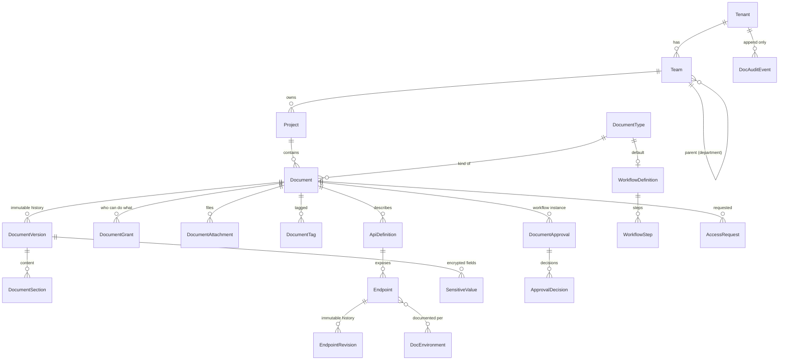
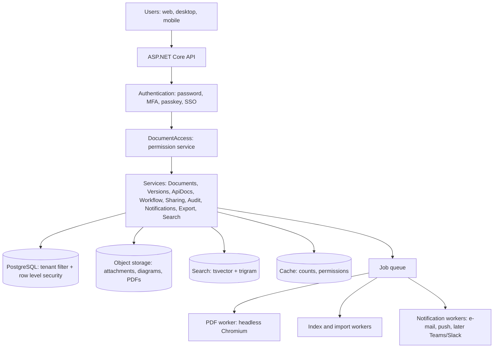
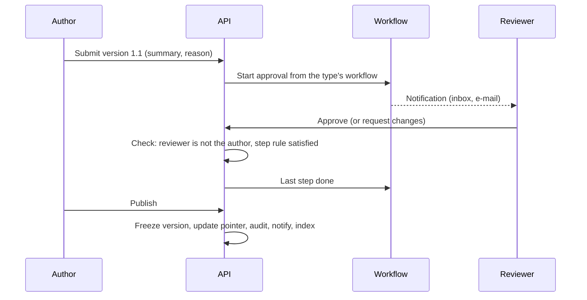
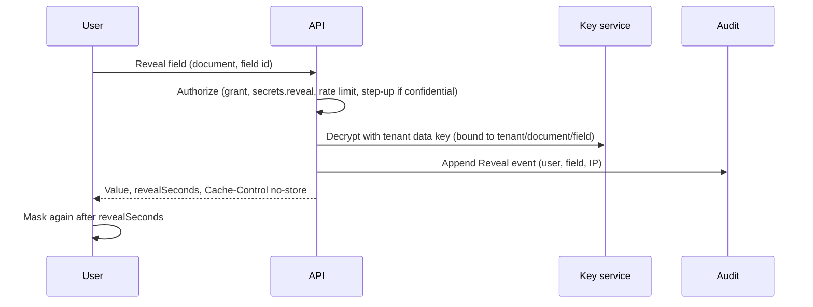

# Proposal (draft for review, nothing built): Documentation and BRD platform inside Project Tracker

**Status:** draft for discussion. No product code has been written. Decide the open questions in section 14, then we build release by release (section 11), each release shipped, tested and merged on its own.

**Reference studied:** `projecttrackerindia/doctracker` (Node/Express, PostgreSQL, plain JavaScript front end). We port its ideas into our stack (ASP.NET Core 9, EF Core, React 19). We do not port its code.

---

## 1. The idea in one paragraph

Teams already plan work in Project Tracker. What they write about that work (BRDs, API documentation, test plans, architecture notes, release notes) lives somewhere else, with no link to the project, no real access control, no history and no proof of who saw a secret. The proposal is a **Documents module** inside the product: every document belongs to a project, a team and an organization, is typed (BRD, API documentation, ...), is versioned without overwriting, moves through a configurable approval workflow, is shared with exact people, teams and roles, hides secrets until a permitted person reveals them for a few seconds, and exports to PDF. It reuses what we already have (tenants, teams, roles, projects, audit, notifications, file storage, jobs, billing plans) instead of building a second product.

## 2. What the analysis found

### 2.1 Our application (what we can reuse)

| Need in the brief | What exists today | Verdict |
|---|---|---|
| Multi-tenant, data of one organization never visible to another | `Tenant`, `TenantEntity`, `ITenantScoped`, EF global query filters, an isolation guard test, tenant-aware tests on SQLite and PostgreSQL | **Already built.** New tables only have to follow the same pattern. This is the biggest saving. |
| Organization, teams, members, team leads | `Tenant`, `Team`, `TeamMember(IsLead)`, `TenantMember(Role, OrgRoleId)`, org chart `OrgRole` | Reuse. Add an optional parent on `Team` for "Department". |
| Roles and permissions | `TenantRole` (Owner, Admin, Manager, Member, Guest), permission catalog (`Permissions`), per-tenant overrides, job-role `AccessProfile`, `ProjectScope` filters in the data layer | Reuse and extend with document permissions. Do not change the `TenantRole` enum. |
| Project to team link | `Project.TeamId`, team lens, `ProjectAccess` | Documents hang off `Project`. |
| Authentication | Passwords, MFA, passkeys, phone approval, SSO (OIDC and SAML), SCIM, sessions, API keys | Reuse. Step-up for secrets reuses MFA and passkeys. |
| Audit | `AuditLog` (user, action, entity, old/new value, IP, user agent), `Recorder` | Extend (new actions, tamper evidence, retention). |
| Notifications | `Notification` with in-app, e-mail, push, browser, dedupe, workers | Reuse. Add document event types. |
| Files | `Attachment`, `IFileStorage` (local and S3), content checks, SHA-256 | Reuse for document attachments and diagrams. |
| Background jobs | `ReportExport` entity and `ReportExportWorker`, workers for e-mail, push, webhooks | Reuse the export queue for PDF. |
| Encryption at rest | `ISecretProtector` (AES-256-GCM, random nonce, authenticated) | Reuse, then add key versioning (section 8). |
| Search | `pg_trgm` indexes migration, global search (Ctrl K) | Extend to documents, endpoints, tags. |
| Billing and limits | Plan catalog, `EntitlementService` (per-person limits, pooled storage) | Add a `DOCS` feature and limits. |
| API quality | Idempotency keys, If-Match, rate limiting, public OpenAPI, Swashbuckle | Reuse. |
| Diagrams | `@xyflow/react` is already in the front end (org chart canvas) | Reuse for the visual diagram editor (release 5). |
| PDF | `PdfWriter` inside `ReportDocument` (a small hand-written writer for tabular reports and invoices) | **Not enough** for rich documents. See section 9. |

### 2.2 The reference (DocTracker): what to learn from it

Strengths worth porting (as ideas):

- **Environment-scoped, time-boxed access requests** with a full history and "a requester can never approve their own request".
- **Envelope encryption with admin-triggered key rotation**, and secrets never returned to the browser (AI key shown only as "configured").
- **Server-recorded audit log**; the client cannot write it.
- **PII masking rules**, enforced on the server and mirrored in the UI.
- **Release pipeline**: diff two environments, a required release note, an acknowledgement of breaking changes, one pending request per target, and a `breakingChangeDetector` that flags only changes a client would really break on.
- **Export**: OpenAPI, Postman collection import/export, PDF.
- **SSRF-safe outbound HTTP** (needed if we ever build "Try it").

Weaknesses we must not copy:

| DocTracker choice | Why it will not scale for us | Our approach |
|---|---|---|
| A whole project (endpoints, attachments, everything) is one encrypted JSON blob in `projects.data` | Cannot query, search, index or paginate; every change rewrites the blob; thousands of endpoints per project is impossible; no row-level security | Normalized tables: `ApiDefinition`, `Endpoint`, `EndpointRevision`, with indexes |
| Authorization is partly in a front-end state object and in a 3,600-line `workspace.js` | Hard to reason about, hard to test | One `DocumentAccess` service, one permission model, data-layer filters |
| Plain JavaScript, 26 order-dependent script files, no bundler | No types, no component reuse | Our typed React app |
| No route-level or database tests | Regressions slip in | Dual-engine integration tests per release (our existing standard) |
| In-memory per-process throttles | Wrong behavior with several instances | Our existing shared rate limiting |
| No SAML, no SCIM | Enterprise blocker | We already have both |
| Observability agent, log explorer, alert engine for MuleSoft traffic | A different product (runtime monitoring) | **Out of scope**. Revisit only if asked. |
| "Try It / Live mode" outbound calls | A large attack surface (SSRF), not in this brief | Optional, release 6, only with the SSRF rules from `urlSafety.js` ported |

### 2.3 Technical debt and risks in our own code that this work touches

1. `AuditLog` can be updated or deleted by the application's own database user. It must become append-only with tamper evidence before we call it "immutable to normal users".
2. `ISecretProtector` uses one derived key with no key identifier, so rotation is impossible. Needed before storing client secrets.
3. Search is `ILIKE` with trigram indexes. Fine to about 100k rows per tenant; beyond that we need PostgreSQL full text (and an optional external index later). SQLite (used for local development and tests) has no `tsvector`, so every search path needs a portable fallback and tests on both engines.
4. `ProjectAccess` and `ProjectScope` decide visibility of projects. Documents need a **second, finer** layer (a document can be more restricted than its project). That layer must live in the data layer, not only in services.

## 3. Product shape

```
Organization (Tenant)
 ├─ Department (a Team that has child Teams; optional)
 │   └─ Team
 │       └─ Project            (existing)
 │           └─ Document       (new: typed, versioned, workflow-driven)
 │               ├─ Sections, attachments, diagrams, sensitive fields
 │               └─ for API documentation:
 │                    ApiDefinition ─ Endpoint ─ EndpointRevision
 └─ Document types, workflows, roles (all per-organization configuration, seeded with defaults)
```

A document belongs to exactly one project (so team and organization follow). A BRD that several teams need is **allocated** (shared) to them; it is not copied.

## 4. Document types are data, not code

`DocumentType` is a row: name, icon, **section template** (ordered list of section definitions with a field kind: rich text, table, list, key-value, api-list, diagram, risk register, ...), default workflow, whether it supports API definitions, and default sensitivity. Seeded types: BRD, API documentation, technical, functional, test plan, test cases, test results, integration, architecture, deployment, operational, project, process, security, release, environment. An administrator can add a type or edit a template without a deployment.

A document stores its content as **sections** (`DocumentSection`: key, title, kind, order, content JSON). Structured fields and rich text live side by side: a BRD "Risks" section is a table with columns (risk, impact, mitigation, owner); "Business requirements" is rich text. Rich text is stored as ProseMirror JSON (TipTap on the front end), never as raw HTML, which removes a whole class of XSS issues; HTML is produced only when rendering, through an allow-list sanitizer.

## 5. Data model (entities and why each exists)

Names follow the brief. Everything marked **T** is `TenantEntity, ITenantScoped` with the usual global filter.



| Entity | Why it exists |
|---|---|
| `DocumentType` **T** | Makes document kinds configuration. Holds the section template and default workflow. |
| `Document` **T** | The stable identity (title, project, owner team, owner user, type, status, current published version pointer, sensitivity class, visibility mode). Never holds content. |
| `DocumentVersion` **T** | Immutable snapshot: number (major.minor), created by/at, change summary, change reason, approval status, published flag, content hash. A "draft" is the one mutable working version per document; publishing freezes it. |
| `DocumentSection` **T** | Content of a version, one row per section. Allows section-level diff and per-section edit locks later. |
| `DocumentAttachment` **T** | Links `Attachment`/storage objects (images, diagrams, files) to a version so they are versioned with it. |
| `ApiDefinition` **T** | A named API inside an API document (base path, auth scheme, owner, version). |
| `Endpoint` **T** | One method + path, indexed for search. Thousands per tenant are normal rows, not JSON. |
| `EndpointRevision` **T** | Immutable JSON of the endpoint's details (headers, parameters, body schema, responses, errors, samples, dependencies) per document version. Enables compare and breaking-change detection. |
| `DocEnvironment` **T** | Dev, SIT, UAT, Prod... per organization, with an ordering and a "restricted" flag; endpoint details can differ per environment. |
| `SensitiveValue` **T** | Encrypted secret attached to a section or endpoint (key id, ciphertext, class, last-rotated). Content JSON holds only a reference token, never the value. |
| `DocumentGrant` **T** | The permission list of a document: principal (user, team, org role, project, tenant role), permission set, optional expiry, source (direct, allocation, request). One table answers "who can see this and why". |
| `DocRole` **T** | Named permission bundles (Documentation Owner, Editor, Contributor, Reviewer, Viewer, ...), seeded and editable. |
| `WorkflowDefinition`, `WorkflowStep` **T** | The configurable lifecycle: ordered steps, approver (user, team, role), any/all rule, due time. |
| `DocumentApproval`, `ApprovalDecision` **T** | A running workflow on a version and each person's decision with comment. A requester can never approve their own change. |
| `AccessRequest` **T** | Self-service request with reason, requested permission and duration, decision, decider, expiry; full history kept. |
| `DocAuditEvent` | Append-only audit stream for documents (see section 10). May share storage with `AuditLog` via new actions; kept as a separate partitioned table if volume demands it. |
| `Tag`, `DocumentTag` **T** | Free tags for discovery. |
| `DocSearchRow` **T** (derived) | Search projection (title, text, path, tags, owner, status) maintained by a worker; one row per document, section group and endpoint. |

Not created (the brief lists them, we already have them): `Organization` (=`Tenant`), `User`, `Role` and `Permission` (=`TenantRole`, `Permissions`, `OrgRole`, `AccessProfile`), `Team`, `TeamMember`, `Project`, `Notification`, `AuditLog`, `Attachment`.

All new tables get tenant id as the **leading column of every index** so one tenant's queries never scan another's rows.

## 6. Authorization (the part that must be right)

### 6.1 Roles from the brief mapped onto what exists

| Brief role | Implemented as |
|---|---|
| Organization Admin | `TenantRole` Owner / Admin |
| Documentation Admin | New permission `docs.admin` given through the existing job-role access profile or tenant override (no enum change) |
| Team Admin | `TeamMember.IsLead` plus `docs.team.manage` |
| Project Owner | `Project.OwnerId` |
| Documentation Owner, Editor, Contributor, Reviewer, Viewer | `DocRole` rows applied through `DocumentGrant` |
| Auditor | New permission `docs.audit.read` (read-only access to audit and access reports, no content unless granted) |

### 6.2 Permissions

`docs.view, create, edit, delete, download, export, share, approve, publish, archive, versions.manage, users.manage, permissions.manage, secrets.reveal, audit.read, admin`. They join the existing `Permissions` catalog, so the per-tenant override screen and job-role profiles work with them unchanged.

### 6.3 Effective-permission rule (deterministic, testable)

For user U on document D (same tenant, always):

1. **Explicit deny** grant on D for U, U's team, role or project wins over everything except Owner/Admin of the organization.
2. Otherwise permissions are the **union** of: (a) organization-level docs permissions from U's tenant role and job-role profile, restricted to the document's **visibility mode**; (b) project membership if the mode is `Project`; (c) team membership if the mode is `Team`; (d) every unexpired `DocumentGrant` that matches U directly, by team, by org role or by project.
3. Visibility modes: `Private` (owner and grants only), `Team`, `Project`, `Organization`. Default is the most restricted of `Project` and the type's default.
4. Sensitive actions (`secrets.reveal`, `download`, `export`, `publish`) additionally require the document's sensitivity policy.

### 6.4 Enforcement (not only the UI)

- **Data layer:** an EF global query filter on `Document` (and, through it, on versions, sections, endpoints, attachments, search rows) hides documents the current user cannot at least view. Same mechanism as `ProjectScope`, so every query, report and assistant tool gets it for free. Aggregates (dashboard counts) also go through it.
- **Service layer:** one `DocumentAccess` service answers `Can(user, document, permission)` for each action; every controller action calls it; no controller decides on its own.
- **PostgreSQL row-level security** as a second net for the `Document*` tables (policy on tenant id and a session setting), enabled in release 4. SQLite keeps the application filter only.
- **Tests:** a permission matrix test (roles x actions x visibility modes) and a cross-tenant test per endpoint, on both engines.
- A user who cannot see a document gets **404, not 403**, unless they hold a pending or possible access path; the "Request access" screen is reached only for documents whose existence the user is allowed to know (title and owner team shown; no content).

## 7. Workflow and approval (configurable)

States: `Draft -> InReview -> ChangesRequested -> Approved -> Published -> Archived` (fixed vocabulary, so the UI and reports stay simple).
What is configurable is the path: a `WorkflowDefinition` per document type with ordered `WorkflowStep`s, for example

- BRD: Author -> Business Owner -> Technical Owner -> Approval
- API documentation: Developer -> API Owner -> Architect -> Approval

Each step names an approver (a user, a team, or a role), a rule (any one / all), and an optional due time. Rules: a requester cannot approve their own submission; editing an in-review version sends it back to Draft (or creates a new draft); publishing needs `docs.publish`; every transition writes an audit event and a notification; the definition in force when a version was submitted is copied onto the approval so later edits to the workflow do not rewrite history.

## 8. Versioning, sensitive data, diagrams

### 8.1 Versioning

- One mutable **draft** per document. Publishing freezes it as `vMajor.Minor`; the next edit forks a new draft. Nothing is overwritten.
- Minor (1.1) for edits, major (2.0) when the author or the workflow marks a significant change. Change summary and reason are required on submit.
- **Compare:** section-level and field-level diff (text diff inside rich text, row diff inside tables, JSON diff for endpoints). Breaking-change flags for API versions are ported from DocTracker's detector (removed required parameter, changed response shape, narrowed type).
- **Restore** creates a *new* version copied from the old one; the old one stays.
- Attachments and diagrams are referenced by version, so restoring brings back the exact images.

### 8.2 Sensitive information

| Requirement | Design |
|---|---|
| Masked first | Sections carry `{"sensitive": "<id>"}` tokens. The API returns the token and a mask, never the value. |
| Encrypted at rest | `SensitiveValue.Cipher` with AES-256-GCM through `ISecretProtector`, **extended with a key id and version** and a per-tenant data key wrapped by the master key (envelope encryption), so keys can be rotated by an administrator with a re-encrypt job. Associated data binds a value to its tenant, document and field so copied ciphertext does not decrypt elsewhere. |
| Reveal | `POST /documents/{id}/sensitive/{sid}/reveal`: checks `docs.secrets.reveal` and the document grant, enforces a short rate limit, writes `Reveal` to the audit trail (who, which field, when, IP), then returns the value with `Cache-Control: no-store` and `revealSeconds`. |
| Timed re-masking | The browser hides the value after the configured time (10, 15, 30, 60 s or custom, set per organization in security settings). **Honest limit:** a server cannot take back what was already shown, so the timer is a safeguard against shoulder-surfing and left-open screens, not a guarantee against copying. The audit trail and optional step-up are the real controls. |
| Higher classes | Fields marked `Confidential` require **MFA or passkey step-up** before reveal (reusing existing flows). |
| Not in logs | The logging pipeline (Serilog) gets a destructuring filter for sensitive types; the front end never keeps revealed values in state outside the component, never in `localStorage`, and the API never echoes them on save. |
| Exports | PDFs and exports show masks unless the exporter holds reveal permission and chooses "include secrets" (audited). Default is masked. |

### 8.3 Diagrams

Three levels, shipped in this order:

1. **Image upload** (PNG, SVG, JPEG; scanned and type-checked like attachments; SVG sanitized).
2. **Text diagrams** (Mermaid: flow, sequence, architecture, data flow) stored as source text in the section, so they diff, version and render identically on screen and in PDF.
3. **Visual editor** on `@xyflow/react` with an icon library (source system, integration layer, target system), stored as JSON and exported to SVG. This is the largest item and is deliberately last.

## 9. PDF generation

The existing `PdfWriter` is fine for tables and invoices but cannot produce a cover page, table of contents, rich text, tables that break across pages, or diagrams. Options:

| Option | Fidelity (rich text, tables, SVG diagrams) | Operations | Cost |
|---|---|---|---|
| A. Headless Chromium rendering an HTML template in a separate worker container | Best; one template serves screen preview and PDF | A ~400 MB container image, a pool of browsers | Free |
| B. QuestPDF (.NET library) | Good for layout; rich text and SVG need conversion work | No extra container | Free for small companies, **paid license** above a revenue threshold |
| C. Keep `PdfWriter` | Poor | None | Free |

**Recommendation: A**, run through the existing export queue (`ReportExport` row, `ReportExportWorker`-style worker, result stored in `IFileStorage`, notification when ready, link expires). Reasons: diagrams and tables are the product here; one HTML template gives preview and PDF; no license question. The cover page carries organization, team, project, title, version, author, approval record, then table of contents, sections, API details, revision history. Rendering runs with no network access and from a sanitized HTML snapshot, so a document cannot make the server fetch internal URLs.

## 10. Audit, search, dashboard, notifications

**Audit.** Events: created, modified, submitted, approved, rejected, published, version restored, downloaded, exported (PDF), grant added or removed, access requested or decided, sensitive value revealed, secret rotated, permission changed, export of audit. Each carries user, action, resource, time, IP, device, old and new value (secrets never). Tamper evidence: each row stores a hash of its content and of the previous row of the same tenant (a hash chain); a verification job and an administrator "verify audit" action detect gaps or edits. PostgreSQL: the application role gets `INSERT`/`SELECT` only on the table; monthly partitions; retention configurable per organization. Reading the trail needs `docs.audit.read` and is itself audited.

**Search.** PostgreSQL full-text (`tsvector` generated column, GIN index) on `DocSearchRow`, plus the existing trigram indexes for fuzzy and path matches (`/customer`, `JWT`). Filters: type, project, team, owner, status, tag, date range, version. Results always pass the document access filter before ranking, so a title never leaks. Pagination is keyset (cursor), never offset. If the server lacks the extensions, or on SQLite, search falls back to `ILIKE`. An external engine (OpenSearch) stays a later option behind the same `ISearchIndex` interface; we do not need it for tens of thousands of endpoints.

**Dashboard.** Counts by team, type, status; pending review/approval for me; recent updates; access requests; audit highlights for auditors. All numbers come from queries that go through the access filter, so people only see what they may see. Hot counts are cached for 30-60 seconds per user and invalidated by events.

**Notifications.** New `NotificationType` values for: access requested/approved/rejected, assigned, updated, submitted for review, approved, published, version released. They go through the existing pipeline (in-app, e-mail, push, SignalR). The delivery channel stays an interface so Teams and Slack can be added as channels later without touching document code.

## 11. Releases, MVP priorities and acceptance criteria

Priorities use MoSCoW. **MVP = releases D1 to D3** (a team can write, version, share and get a BRD approved, with a trustworthy audit trail). Each release ships to `main` on its own with migrations, tests on SQLite and PostgreSQL, docs and website text updated (our usual rule).

Size guide: S about 1 week, M 2 to 3 weeks, L 4 or more, for one engineer; sizes are estimates to be refined after D1.

### D1 Foundation: documents, types, sections, project link (M)  *Must*

Scope: `DocumentType`, `Document`, `DocumentVersion`, `DocumentSection`, tags, project "Documents" tab, BRD template and the creation wizard (Basic information to Review), rich text (TipTap), tables, links, drafts, soft delete; `docs.*` permissions in the catalog; department (`Team.ParentTeamId`); plan feature `DOCS` and limits.
Acceptance criteria:
1. A user with `docs.create` creates a BRD from the template in **at most 6 wizard steps** and saves a draft; reload restores every field.
2. A user without `docs.view` gets **404** for a document id in 100% of API tests; a user from another tenant gets 404 in 100% of tests across **every** document endpoint (generated cross-tenant test).
3. Permission matrix test covers every role x action x visibility mode; **0 failing cells**.
4. Document list of 10,000 rows returns the first page in **under 300 ms (p95)** on PostgreSQL with the seeded benchmark data; cursor pagination, no offset.
5. Rich text is stored as JSON and rendered through a sanitizer; a stored `<script>`/`onerror` payload is never executed (XSS test passes).
6. Migration applies on an existing production-like database with data intact; down-migration tested.

### D2 Versions, compare, allocation and sharing (M)  *Must*

Scope: immutable versions, publish/freeze, compare view, restore-as-new-version, change summary and reason, `DocumentGrant`, `DocRole`, allocation UI (teams, projects, users, roles, expiry), "who has access and why" panel, attachments and image upload.
Acceptance criteria:
1. Editing a published document never changes a previous version: **byte-identical content hash** on all prior versions (test).
2. Restore creates version N+1 whose content hash equals the restored one; history shows both.
3. Compare of two versions with 200 sections renders in **under 1.5 s**; unchanged sections are collapsed.
4. The access panel lists every person with access, their effective permissions and the **source** (direct, team, allocation, request); for a seeded matrix of 30 users the panel matches the permission service output **exactly** (test).
5. Revoking a grant removes access on the **next request** (no cache lag beyond 5 s, test).
6. Attachments over the plan limit or with a disallowed type are rejected with a clear message; stored files are tenant-prefixed and never served without a document check.

### D3 Workflow, approvals, access requests, notifications (M-L)  *Must*

Scope: `WorkflowDefinition/Step`, submit/approve/request changes/publish/archive, per-type workflows (BRD and API), configuration screen, `AccessRequest` with reason, duration and decision history, notifications for every event, approvals inbox, the audit events for all of this, audit read screen.
Acceptance criteria:
1. A submitter can never approve their own submission (API test and UI).
2. A workflow edited after submission does not change a running approval (snapshot test).
3. The state machine rejects every illegal transition (table-driven test of all state x action pairs).
4. A blocked user sees title, owner team and "Request access"; after approval they can open the document **without re-login** and access expires on the stated date (time-travel test).
5. Each event in section 10 creates exactly one notification per recipient (dedupe test) and one audit row.
6. 100% of state-changing document endpoints write an audit row (reflection test enumerating controllers).

### D4 API documentation (L)  *Should*

Scope: `ApiDefinition`, `Endpoint`, `EndpointRevision`, `DocEnvironment`, endpoint editor (method, URL, description, headers, auth, parameters, body, responses, errors, samples, dependencies, owner), tree navigation, OpenAPI 3 import/export, Postman v2.1 import/export, breaking-change detection between versions, environment-scoped visibility.
Acceptance criteria:
1. A project with **5,000 endpoints** loads its tree (lazy, by API) in **under 500 ms (p95)**; searching a path fragment returns in **under 300 ms**.
2. Import of a 500-endpoint OpenAPI file completes in **under 30 s**, reports line-level errors, and round-trips (export of the import equals the original semantically).
3. Breaking-change detector reproduces the DocTracker test cases (removed required parameter, changed response shape) and flags nothing for additive changes.
4. Pagination everywhere; no endpoint returns an unbounded list (test asserts a maximum page size).

### D5 Sensitive data and security hardening (M-L)  *Must for security-sensitive customers, Should otherwise*

Scope: `SensitiveValue`, envelope encryption with key versions and rotation, reveal flow with admin-set duration (10/15/30/60/custom), step-up (MFA or passkey) for confidential class, masked exports, log scrubbing, hash-chained audit with verification, PostgreSQL row-level security, retention.
Acceptance criteria:
1. A grep/test over all API responses, logs and PDFs for seeded secret values finds **zero** occurrences outside a successful reveal response.
2. Reveal without permission returns 403 and writes a denied event; with permission it writes a `Reveal` event with user, field and IP in **100%** of calls.
3. The reveal duration is enforced in the UI: the value is masked again within **1 s** of the configured time (browser test for each preset).
4. Key rotation re-encrypts **10,000 values** without downtime and without failed reads (test); old key versions decrypt until the job completes.
5. Altering or deleting one audit row makes `verify` fail and identify the row (test); the application database role cannot `UPDATE` or `DELETE` audit rows (checked in the PostgreSQL CI job).
6. A confidential reveal without a fresh MFA/passkey check is refused.

### D6 PDF, search, dashboard, diagrams (L)  *Should (PDF) / Could (visual editor)*

Scope: export queue and Chromium renderer, cover page, table of contents, revision history, masked by default; PostgreSQL full-text search with filters; dashboard and reports; Mermaid diagrams, then the visual diagram editor; SSO group to team mapping for document roles; optional "Try it" with SSRF protections.
Acceptance criteria:
1. A 100-page document exports in **under 60 s** off the request path; the request returns immediately with a job id; the user is notified; the download link expires.
2. The PDF contains: organization, team, project, title, version, author, approval record, working table of contents with page numbers, tables, diagrams, API details, revision history (checked by text extraction in the test).
3. Concurrent export of 20 documents does not exceed the configured browser pool and never blocks API requests (load test).
4. Search over 100,000 documents and 500,000 endpoints answers in **under 400 ms (p95)**; a user never sees a result for a document they cannot view (test with a hostile data set).
5. Dashboard numbers equal the count of documents the user can open (property test over random permissions).
6. Mermaid diagrams render identically on screen and in PDF; the visual editor saves and reloads a 200-node diagram without loss.

### Must / Should / Could summary

| Priority | Items |
|---|---|
| **Must (MVP, D1-D3)** | Documents and types, BRD wizard, versions and compare, allocation and access panel, backend-enforced permissions, workflow and approvals, access requests, notifications, audit events |
| **Must for security (D5)** | Sensitive values, reveal, encryption with rotation, tamper-evident audit |
| **Should** | API/endpoint documentation at scale, OpenAPI/Postman, PDF export, full-text search, dashboard |
| **Could** | Visual diagram editor, SSO group mapping, external search engine, Teams/Slack channels |
| **Won't (now)** | Runtime log/observability agent, alert engine, live "Try it" calls (revisit after D6) |

## 12. Non-functional targets (apply to every release)

| Area | Target |
|---|---|
| Authorization | Zero known paths where the UI restricts but the API allows; matrix and cross-tenant tests in CI for each release |
| Performance | p95 under 300 ms for list/get, under 500 ms for tree/search at the stated data sizes, measured on PostgreSQL in CI with a seeded benchmark |
| Availability of existing features | The full existing suite (643+ tests) and the browser smoke test stay green on every merge |
| Scalability | No unbounded queries; keyset pagination; indexes led by tenant id; heavy work (PDF, import, re-encryption, search indexing) on workers; stateless API so it scales horizontally |
| Security | OWASP ASVS L2 checklist for the module; secure headers and CSP unchanged; uploads scanned by type and size; rate limits on reveal, export and access requests |
| Compatibility | Additive migrations only; existing screens, APIs and the mobile and desktop apps keep working; the module is hidden until the plan feature is on |
| Accessibility and responsive | WCAG 2.1 AA for the new screens, keyboard operable editor, usable at 360 px (tables become cards as elsewhere) |
| Documentation | OpenAPI (public spec) updated each release, `docs/` architecture page, README and website feature text, admin guide for workflows and secrets |

## 13. High-level architecture and flows







Access request flow: blocked user sees title and owner team -> **Request access** (reason, permission, duration) -> owner or team lead notified -> approve (creates an expiring `DocumentGrant` with source `request`) or reject (history kept) -> requester notified.

## 14. Decisions needed from you

1. **Inside Project Tracker or a separate product?** Recommendation: **inside** (a "Docs" area per project and an organization-wide "Documents" view). It reuses tenants, teams, roles, billing, audit and apps, and avoids a second login and a second database. A separate DocTracker app would duplicate all of that.
2. **PDF engine:** headless Chromium worker (recommended) or QuestPDF (license applies above a revenue threshold).
3. **Plan placement:** which plans include Documents, and limits (documents, endpoints, PDF exports per month, sensitive fields, history retention). Suggestion: a small free allowance (3 documents), full on Pro, secrets, step-up, audit export and RLS on Business.
4. **Which DocTracker extras to bring:** environment promotion with release notes (suggested in D4/D6), Postman/OpenAPI (in D4), AI drafting from notes using our Assistant and its credits (natural fit, suggested after D3), "Try it" live calls (suggested to postpone), observability (suggested to leave out).
5. **Confidential-class policy:** which fields always require step-up (suggested: anything marked Confidential, plus production credentials).
6. **Audit retention default** (suggested 2 years, configurable).
7. **Hosting for the PDF worker:** a second container beside the API, or on-demand job.

## 15. Risks and how we handle them

| Risk | Handling |
|---|---|
| Document-level visibility makes every list and count slower | Index by tenant first, filter in SQL, cache counts briefly, benchmark in CI from D1 |
| Permission rules become hard to explain | One `Can()` function, one explanation endpoint behind the access panel, matrix test |
| Secrets leak through side channels (logs, exports, caches, browser) | Section 8.2 controls, a leak test that scans responses, logs and PDFs |
| Rich-text and SVG injection | JSON storage, allow-list sanitizer, SVG sanitizer, CSP unchanged |
| Scope too large | MVP is D1-D3; D4-D6 are separate releases that can be reordered |
| SQLite (dev/tests) and PostgreSQL diverge | Dual-engine tests as today; provider-specific code (full text, RLS) isolated behind interfaces with a fallback |

## 16. What we will not change

Existing tasks, issues, sprints, billing, chat, AI assistant, SSO/SCIM, mobile and desktop shells, and all existing APIs stay as they are. The only existing structures touched are: `Team` (one optional parent column), the permission catalog and `NotificationType` (new values), `AuditLog` handling (append-only hardening), `ISecretProtector` (key version, backward compatible), and the plan catalog (a new feature flag and limits).
